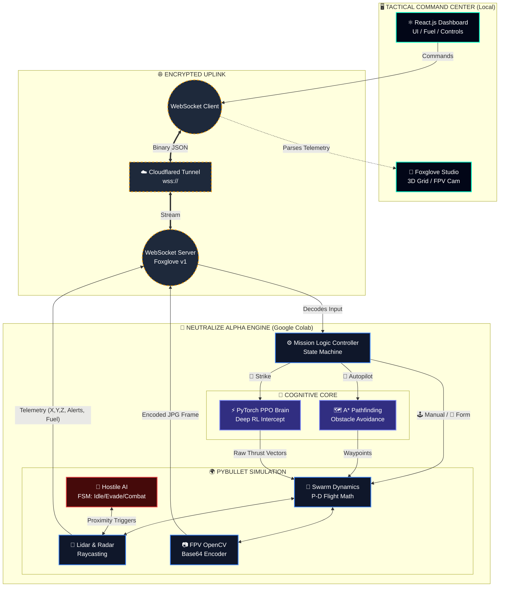

Markdown
<div align="center">
  
# 🦅 NEUTRALIZE ALPHA
### JADC2-Aligned Autonomous Swarm Defense Grid

[](#)
[](#)
[](#)
[](#)
[](#)

*A real-time, bidirectional Command and Control (C2) architecture integrating Headless 3D Physics, A* Pathfinding, and Deep Reinforcement Learning for autonomous swarm operations.*

---
</div>

## 🚀 OVERVIEW

**Neutralize Alpha** is a full-stack, tactical autonomous robotics simulator. It engineers a secure OODA loop (Observe, Orient, Decide, Act) by integrating a headless PyBullet physics engine via an encrypted Cloudflare tunnel directly into a custom React.js dark-mode dashboard.

The system tasks a swarm of 5 quadcopters to navigate a dynamically generated urban environment, utilize Lidar raycasting to avoid skyscrapers, track a hostile AI drone via spatial Radar vectors, and execute autonomous kinetic strikes powered by a trained PyTorch Neural Network.

---

## 🧠 TACTICAL ARCHITECTURE

The architecture is divided into two distinct environments communicating via secure binary payloads (Foxglove WebSocket v1 Subprotocol).

### I. The Physics & AI Backend (Google Colab / Python)
> The "Brain" of the operation, calculating world-state at high frequencies.

* **Headless Physics:** PyBullet calculates gravity, rotor thrust, inertia, and raycast collisions.
* **The Neural Link:** A Proximal Policy Optimization (PPO) Deep Reinforcement Learning algorithm, trained over 50,000 episodes via `Stable Baselines 3`, assumes flight control during combat engagements.
* **A * Pathfinding Autopilot:** A custom grid-search algorithm maps dynamic skyscrapers to calculate collision-free routing.
* **Hostile FSM:** The enemy target operates on a Finite State Machine (`IDLE` -> `EVASIVE` -> `COMBAT`), dynamically reacting and returning fire based on the swarm's proximity.

### II. The C2 Frontend (React.js / Foxglove)
> The "Eyes and Hands" of the operation, rendering the telemetry.

* **Live Status Grid:** Decodes binary JSON packets to display real-time Coordinates, Combat Status, and Swarm Battery/Fuel metrics.
* **Priority Alert System:** Parses asynchronous interrupts for Lidar Emergency Brakes, Radar Locks, and Incoming Fire.
* **3D Visualization:** Foxglove Studio renders the `PosesInFrame` 3D grid, the `astar_path` visualizer, and the Base64 `CompressedImage` FPV camera feed.

---

## ⚙️ SYSTEM CAPABILITIES

| Feature | Execution | Impact |
| :--- | :--- | :--- |
| **P-D Flight Controller** | Custom Proportional-Derivative math | Maintains dynamic V-Formations and stable hovering against 9.8m/s² gravity. |
| **Lidar Sensor Fusion** | Real-time PyBullet Raycasting | Detects urban obstacles, engaging autonomous emergency braking and locking manual controls to prevent collisions. |
| **Deep RL Strike** | PyTorch Neural Network Inference | Overrides hardcoded math, allowing the Alpha drone to intuitively hunt erratic targets. |
| **Lethal Override** | Spatial Hitbox Detection | Physically neutralizes the enemy flight controller upon a 1.5m proximity breach. |

---

## 🛠️ DEPLOYMENT PROTOCOL

### Step 1: Initialize the Engine (Colab)
1. Open a Google Colab notebook.
2. Install the core dependencies:
   ```bash
   !pip install stable-baselines3[extra] gymnasium pybullet websockets nest_asyncio
3. Run the Master Server script to generate the urban grid and train/load the alpha_brain.zip model.

4. Extract the secure wss://...trycloudflare.com URL from the terminal uplink logs.

### Step 2: Boot the Command Center (Local)
1. Clone this repository and access the React dashboard:

   ```bash
   git clone [https://https://github.com/Arjo216/neutralize-alpha-swarm](https://https://github.com/Arjo216/neutralize-alpha-swarm)

   cd neutralize-alpha/swarm-dashboard
2. Install Node dependencies and launch:

   ```bash
   npm install

   npm run dev
3. Paste the Colab wss:// URL into the INITIALIZE UPLINK bar to establish the secure         handshake.

---


---

### 🎮 COMMAND MATRIX Tactical Controls (CLI)

The tactical dashboard supports complete Human-in-the-Loop oversight.

| Command | Action | Description |
| :--- | :--- | :--- |
| **`[ 📐 FORMATION V ]`** | *Formation* | Swarm locks into a synchronized V-formation and hovers at Z=5. |
| **`[ 🌪️ EVASIVE ]`** | *Evasive* | Injects randomized movement vectors to scatter the swarm and dodge incoming hostile fire. |
| **`[ 🚀 AUTOPILOT ]`** | *Autonomous Nav*| Engages the A* algorithm. The path is visually drawn in the 3D grid, and the swarm navigates to the target X/Y coordinates. |
| **`[ 🎯 STRIKE TARGET ]`**| *AI Intercept* | Disengages the P-D math and activates the PyTorch Neural Network to autonomously hunt and ram the hostile target. |
| **`[ 🛑 ABORT / RTB ]`** | *Halt / Refuel* | Swarm cuts engines, returns to a holding pattern, and rapidly replenishes the Fuel Gauge. |
| **`[ W, A, S, D ]`** | *Translate* | Manual override to fly the Alpha drone Forward/Left/Back/Right. |
| **`[ R, C ]`** | *Altitude* | Rise (Ascend) or Crouch (Descend) the swarm via manual override. |

*Note: Movement commands can be chained for burst maneuvers (e.g., `WWWD` moves 6m forward, 2m right).*

<div align="center">
<i>"Dominate the airspace. Neutralize the threat."</i>


<b>Designed and Engineered for the Modern Tactical Grid.</b>
</div>
